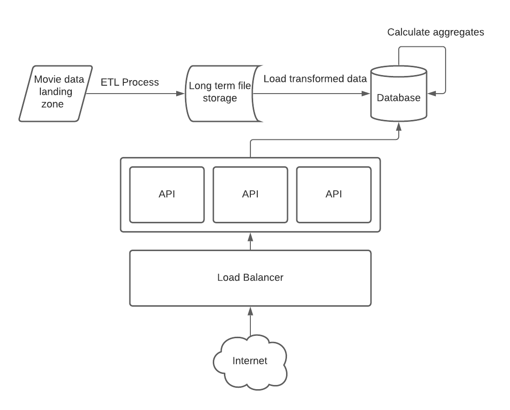

# System Diagram

## Initial ETL

The etl process can be kicked off by an event that triggers when the movie data files arrive. This gives the 
benefit of ensuring the process triggers only when new data arrives and triggers immediately upon arrival. 
The drawbacks are that it introduces extra components (one to listen to arriving files, one to trigger the etl process,
and an event transit mechanism) into the system that need to be monitored and maintained.
It's worth having these additions for the consistency in the etl as well as useability in the rest of the system.
Issues with the etl application would need to be logged and picked up by a monitoring system. Then, depending on the priority of 
the process, alerts would need to be sent out the relevant team for fixing.

## Long term file storage

A location to store files (both raw and transformed files) is desired in case the data ever needs to be reprocessed or audited.
This ensures that if bugs are later detected in a downstream process the issue can be traced back all the way to the source if needed.
It then becomes possible to diagnose if it's an issue with our system or the source data itself. It also provides the capability to later reprocess
the data with new or updated rules. This does incur some additional data storage (although storage space is generally cheap) since it will be stored in
multiple different formats (raw, transformed, database tables in future steps) as well as needing security setup as to who can access the storage and what actions 
can be performed on the files (create/delete/move).

## Database / Datawarehouse

Initially the transformed data would need to be loaded into the database. This would be done by bulk inserting into staging tables and then
merging the data with the destination tables which ensures the process works for new and updated data. This is extra development
to create two sets of near identical tables but gives us the ability to compare existing data with incoming data if needed. Since we know some 
of the query patterns it might make sense to load additional tables with the aggregated data (profit per company per year, etc). 
This data set does not appear like it would ever grow very large so any standard relational database would work fine. 
The downside here is if we wanted to later use this database as a warehouse for all of our data (including data not relating to movies)
it might need to be migrated to a system more specifically focused on data warehousing. Short of hundres of terabytes this isn't likely to be an issue
and the cost savings of standard databases versus a full fledged warehousing system might be worth the migration cost later on. This layer also might not be needed 
to store all data all time if the file storage layer can be used as the warehousing system. Then databases could be used as marts where only certain data is loaded
to each one (in this case a data mart for movies). Either approach could then be used by reporting systems, api's, or analysts themselves. If high availability is needed
then additional setup would be required to provide an additional server and a method to failover from the main server to the backup when one goes down.

## API / Load Balancer

To present data to different types of end points a rest api could be used. The api would only need a few different GET routes to provide access to the data since. Since all
the api needs to do is provide access to our data storage layer it would be easy to horizontally scale this out as much as needed. Any performance issues here are likely to be on
the database and the speed at which it can accept requests and return the data. Potentially some sort of caching could be implemented between the api and the database but this would introduce
another componenet needing maintenance and monitoring. Due to the size of this data and the fact we can save the aggregated data in the database itself the cache could be left out initially and only
introduced later if it was really needed. Any issues with the api's would need to be logged and picked up by a monitoring service. It could also be useful to record metrics about the performance of the apis
like how long it takes to return a response. If these api's are only for specific user access then some kind of authentication token would need to be put in place along with a method to validate those tokens
against a store of allowed users. If an instance of the api goes down then the load balancer would send incoming requests to the remaining instances while an automated process brings up a new api instance.

